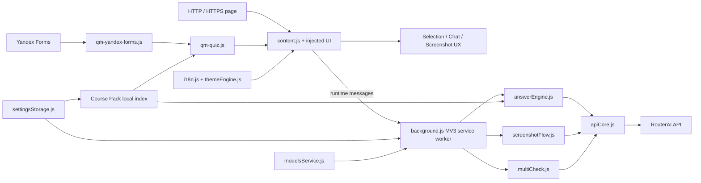

<p align="right">
  <a href="README.md">Русский</a> · <b>English</b>
</p>

<p align="center">
  
</p>

# QuizMind Yandex Forms

<p align="center">
  <b>Manifest V3 Chrome extension for AI-assisted text, screenshot, and Yandex Forms workflows</b><br />
  Semantic DOM extraction · RouterAI · Multimodal screenshot analysis · Multi-model consensus · Course Pack grounding
</p>

<p align="center">
  
  
  
  
  
  
</p>

<p align="center">
  <a href="TECHNICAL.md"><b>Technical reference</b></a> ·
  <a href="COURSE_PACK_GUIDE.md">Course Pack guide</a> ·
  <a href="docs/routerai-smoke-test.md">RouterAI smoke test</a>
</p>

## Overview

QuizMind Yandex Forms is a Chrome extension built around two related workflows. On ordinary HTTP/HTTPS pages it can capture selected text or a screenshot and request an answer through RouterAI. On `forms.yandex.ru`, an additional semantic adapter understands supported form controls, extracts a structured representation of the active question, can prepare answers for visible questions, and can apply an answer only when the separate **Quiz Auto Apply** setting is enabled.

The Yandex Forms path is intentionally based on visible semantics rather than generated React internals. Question labels, native control types, accessible combobox attributes, visible option text, and the current DOM order are used to construct the prompt. Generated IDs and raw input values are not treated as answer labels.

The project also includes configurable RouterAI model selection, screenshot model profiles, Multi-Check consensus, an on-page chat/history UI, RU/EN interface localization, themes, diagnostic logging, test mode, and **Course Pack** grounding that retrieves relevant lecture chunks locally before an AI request.

The previous detailed README has been preserved unchanged in **[TECHNICAL.md](TECHNICAL.md)**. This README is the product/portfolio overview; the technical reference remains the compact source for the original behavior, installation details, Yandex Forms rules, verification forms, limits, and release-safety notes.

## What this project demonstrates

- **Chrome Extension / Manifest V3 architecture** with an MV3 service worker, content scripts, popup, options page, command hotkeys, `chrome.storage`, `chrome.scripting`, `captureVisibleTab`, downloads, and web-accessible UI assets.
- **Semantic DOM adaptation for Yandex Forms** using stable classes, native input types, accessibility roles/attributes, visibility checks, and current visible option order instead of generated framework identifiers.
- **Controlled form interaction** for radio, checkbox, text, numeric, textarea, native select, and accessible custom combobox controls, with matching confidence thresholds and post-action state verification.
- **Multimodal screenshot processing** with manual ROI or viewport capture, CSS-to-capture coordinate mapping, `OffscreenCanvas` crop/resize, JPEG compression profiles, model-aware timeouts, retry/fallback compression, and image prompts sent through RouterAI.
- **Multi-model verification** with parallel structured answers, disagreement detection, an optional debate round, a judge model, confidence/verdict parsing, and majority fallback behavior.
- **Local course grounding** through the `quizmind.coursepack.v1` format, validation/sanitization, local indexing, weighted chunk retrieval, strict size/count limits, and selective injection of only relevant excerpts into Chat and Yandex Forms requests.
- **Defensive AI request handling** with API-key validation, request timeouts, cancellation, limited retries for `429`/`5xx`/network failures, reasoning-model handling, output normalization, and a targeted recovery path for screenshot responses cut off by token length.
- **Browser-side quality and safety checks** with jsdom fixtures, browser smoke tests, manifest/file validation, JavaScript syntax checks, secret-pattern scanning, hostile-model-HTML escaping tests, and explicit tests that answer application never submits the form.

## Main workflows

### Selected text on ordinary pages

```text
text selection
    ↓
selection snapshot + nearby context
    ↓
Find action
    ↓
content script → MV3 service worker
    ↓
RouterAI Chat Completions
    ↓
on-page answer window
```

The selection snapshot is captured before asynchronous work starts, including a cloned DOM Range and the nearest supported question when one exists. On non-Yandex sites the result is displayed, but generic page controls are not scanned or auto-filled.

### Yandex Forms question

```text
selection / focused control / hovered question
    ↓
semantic Yandex Forms adapter
    ↓
question type + visible label + visible options
    ↓
text request OR complete-question screenshot request
    ↓
RouterAI text / vision model
    ↓
prepared answer
    ↓
optional controlled apply + verification
```

Question targeting follows a deterministic priority: current selection → focused control → most recently hovered question → fallback only when exactly one answerable question is visible.

### Screenshot flow

```text
Ctrl/Cmd + Shift + U
    ↓
manual region or visible viewport
    ↓
chrome.tabs.captureVisibleTab
    ↓
ROI mapping + crop + resize + JPEG optimization
    ↓
RouterAI vision-capable model
    ↓
answer window
    ↓
optional screenshot Multi-Check
```

A new screenshot task cancels the previous active task. Model tiers select different timeout/compression profiles, and retriable primary failures can trigger a more aggressively compressed fallback image.

## Yandex Forms support

| Control / content | Behavior |
| --- | --- |
| Single choice | Extracts visible radio options; accepts option label or matching option text. |
| Multiple choice | Parses multiple answer tokens and updates the requested checkbox set. |
| Short text | Writes through the native value path, dispatches input/change-related events, then verifies the visible value. |
| Numeric | Extracts a numeric candidate and writes a normalized value. |
| Long text | Supports `textarea` answers with the same write-and-verify path. |
| Native select | Matches the answer against visible option text and selects the corresponding value. |
| Accessible custom combobox | Opens the controlled listbox, waits for visible options, matches by text, clicks, and verifies the selected/visible state. |
| Question/option images | Marks the question as visual and can capture the complete visible question block for a vision model. |

Intro blocks, detached/hidden controls, date/time controls, and empty matrix shells are intentionally ignored. Automatic application is separate from page scanning, and the code never presses **Next**, **Submit**, or other navigation controls.

## Quiz Page Scan and controlled apply

The scan engine maintains its own cache, in-flight request map, requested-signature set, and per-container applied-signature state. It observes dynamic DOM changes and can discover questions added after initial page load.

Important operational limits are explicit in code:

- prefetch batch size: **3**;
- maximum concurrent prefetch requests: **3**;
- per-page request budget: **60 unique question signatures**;
- answer-cache cap: **200 entries**;
- failed-request retry delay: **20 seconds**;
- DOM mutation ignore window after apply: **3 seconds**.

Answer matching uses exact label/text matching first and then fuzzy text similarity with ambiguity protection. For text fields, the extension verifies the resulting `.value`; for choice controls it respects the state produced by the normal browser click instead of bypassing form-level constraints.

## RouterAI integration

The service worker sends requests to the OpenAI-compatible endpoint:

```text
https://routerai.ru/api/v1/chat/completions
```

Text and image models are loaded from RouterAI's `/models` endpoint. Separate chat/image catalogs are filtered by declared model modalities and cached locally for **24 hours**. Favorite models are persisted in extension settings.

The shared API layer provides:

- `Authorization: Bearer <key>` requests;
- default **25 s** API timeout with workflow-specific overrides;
- one retry after the initial request for timeout/network, `429`, and `5xx` failures;
- `AbortController` propagation and task replacement;
- `max_tokens` / `max_completion_tokens` handling depending on request/model type;
- low-effort reasoning configuration for recognized reasoning models in selected flows;
- safe extraction of assistant content without destructively reducing free-text responses to a single letter;
- screenshot length-recovery request when a response ends with `finish_reason=length`.

## Screenshot and multimodal processing

Screenshot requests are not sent as raw browser captures by default. The pipeline can map a CSS-space ROI to capture pixels, crop with `OffscreenCanvas`, downscale by the longest side, and convert the result to JPEG before the API call.

The request profile depends on the configured model tier. Lightweight, default, and heavier vision models receive different timeout and image-size profiles; the user-configurable screenshot temperature is clamped to `0…1`, and screenshot output is clamped to `32…2048` tokens.

For Yandex visual questions, the extension captures the complete question bounds and sends the screenshot together with the structured question type/prompt/options, so image options remain associated with the visible `A`, `B`, `C`, … order.

## Multi-Check consensus

Multi-Check is a separate verification layer rather than a simple duplicate request. The image pipeline supports:

1. parallel structured model analysis (`OBSERVED`, `OPTIONS`, `DIAGRAM`, `ANSWER`, `CONFIDENCE`, `REASON`);
2. disagreement detection;
3. an optional debate/revision round where each model sees the other candidates;
4. a vision-capable judge receiving the image, real question, and structured evidence;
5. fallback to a text judge or majority result when required.

Text Multi-Check follows the same general idea of collecting independent answers and producing a consensus/verdict. Structured-output token floors prevent the verification format from being truncated by an overly small screenshot token setting.

## Course Pack grounding

Course Pack is a local, preprocessed knowledge layer for course-specific answers. The extension validates `quizmind.coursepack.v1`, stores only supported fields, creates a local search index, and retrieves relevant chunks before a request instead of sending an entire course archive.

Current hard limits:

| Limit | Value |
| --- | ---: |
| Course Pack JSON | 8 MB |
| Lectures | 500 |
| Chunks | 2,000 |
| Chunks selected per request | 8 |
| Added course context per request | 8,000 characters |

Ranking combines query-token matches against keywords, headings, lecture titles, text, and visual descriptions, with extra weight for stronger phrase/keyword matches. Retrieved context explicitly instructs the model to prefer supplied course excerpts over general knowledge when the two conflict.

See **[COURSE_PACK_GUIDE.md](COURSE_PACK_GUIDE.md)** for the schema, generation workflow, OCR/visual-page guidance, chunking rules, and privacy/copyright considerations.

## On-page UI, chat, and settings

The injected UI includes answer, history, chat, Multi-Check, logs, and settings windows with persisted layout state. It supports independent window positions/sizes, configurable screen side/active zone, timers, hotkeys, model selectors, test/developer modes, and themes.

The UI has built-in **English and Russian localization**. Model lists, settings labels, Course Pack controls, hotkey descriptions, and status messages are translated through the local `i18n.js` registry.

The chat path sanitizes message history and attachments before they reach the service worker. Current limits include up to **20** recent messages sent to the model, **4** images in a user message, and **3** file attachments with an **8 MB** per-file / **12 MB** combined file budget. Supported document types include PDF, Office formats, plain text/Markdown, CSV, JSON, and XML. A PDF request can explicitly use RouterAI's `file-parser` plugin with the `mistral-ocr` engine.

## Privacy and safety boundaries

- API keys and settings are stored in Chrome extension local storage; keys are not committed to the repository.
- Selected text, extracted question content, screenshots, and explicit chat attachments are sent only when the corresponding AI request is made.
- Diagnostic content logging is **disabled by default** and does not accumulate diagnostics while disabled.
- Enabled debug logging may include truncated question/answer diagnostics, but API keys are excluded.
- Generic HTTP/HTTPS pages support Find and screenshot workflows, but Yandex-specific scan/auto-apply/visual-question automation remains gated to `forms.yandex.ru`.
- The manifest declares `<all_urls>` because `captureVisibleTab` needs a host/active-tab grant for screenshot capture; content scripts themselves match ordinary `http://*/*` and `https://*/*` pages, not browser-internal schemes.
- Form-answer application is deliberately non-submitting: automated tests verify that no submit/navigation action is triggered.

## Architecture



The main security/architecture boundary is between **page content scripts** and the **MV3 service worker**. Page-facing code extracts semantic context and renders UI; the service worker owns RouterAI network calls, model discovery, screenshot orchestration, Multi-Check, and privileged Chrome API operations.

## Repository structure

```text
.
├── manifest.json                  # MV3 permissions, commands, scripts, popup/options
├── background.js                  # Service worker, routing, injection, privileged APIs
├── apiCore.js                     # RouterAI request/retry/timeout/content handling
├── answerEngine.js                # Text answers and sanitized chat requests
├── screenshotFlow.js              # Screenshot capture, ROI mapping, compression, fallback
├── multiCheck.js                  # Multi-model consensus, debate, judge, verdicts
├── modelsService.js               # RouterAI model catalog, modality filters, 24h cache
├── settingsStorage.js             # Settings + Course Pack validation/index/retrieval
├── promptsConfig.js               # Configurable prompt registry
├── i18n.js                        # English/Russian UI localization
├── themeEngine.js                 # Theme/chameleon behavior
├── logger.js                      # Service-worker diagnostics
├── content.js                     # Main in-page UI, selection, chat, history, capture UX
├── content/
│   ├── qm-yandex-forms.js         # Semantic Yandex Forms adapter
│   ├── qm-quiz.js                 # Scan/cache/matching/controlled apply engine
│   ├── qm-hotkeys.js              # Hotkey parsing/matching
│   ├── qm-markdown.js             # Escaped Markdown/LaTeX rendering
│   ├── qm-windows.js              # Window/layout helpers
│   ├── qm-logger.js               # Content-side diagnostics
│   └── qm-shared.js               # Shared content-script utilities
├── popup.html / popup.js          # Quick controls
├── options.html / options.js      # Full settings interface
├── COURSE_PACK_GUIDE.md           # Course Pack format and authoring workflow
├── examples/course-pack.example.json
├── scripts/                       # Validation and browser/RouterAI smoke tests
├── tests/                         # Node/jsdom regression tests and fixtures
└── ui/                            # Answer/chat/history/window CSS
```

## Quick start

### Requirements

- Google Chrome or another compatible development environment for loading a Chrome MV3 extension;
- Node.js **16+** and npm for development checks;
- a RouterAI API key for live model requests.

### 1. Install development dependencies

```bash
npm install
```

### 2. Run checks

```bash
npm test
npm run check
npm run test:browser:generic
```

### 3. Load the extension

1. Open `chrome://extensions`.
2. Enable **Developer mode**.
3. Choose **Load unpacked**.
4. Select this repository directory.
5. Open the QuizMind Yandex Forms popup → Settings.
6. Add the RouterAI API key and choose text/vision models.

For release verification without live model cost, enable **Test Mode**. It returns mocked answers and is intended for local validation.

## Hotkeys

Default commands declared by the extension include:

| Action | Windows / Linux | macOS |
| --- | --- | --- |
| Screenshot answer | `Ctrl+Shift+U` | `Command+Shift+U` |
| Enable / disable extension | `Ctrl+Shift+L` | `Command+Shift+L` |
| Yandex Forms question | `Ctrl+Shift+H` | `Command+Shift+H` |

Additional in-page hotkeys and their editable settings are documented in the extension UI and technical reference.

## Testing and verification

`npm test` runs Node's built-in test runner over the Yandex adapter suite with jsdom fixtures. The tests cover semantic host detection, supported/ignored controls, dynamic question discovery, image detection, structured prompts, exact/fuzzy matching, radio/checkbox/text/numeric/select/combobox application, selection snapshots, page scanning, hostile model HTML escaping, disabled-log behavior, hotkey matching, and the non-submission invariant.

`npm run check` validates Manifest V3 metadata, required host permissions, all manifest-referenced local files, syntax of every JavaScript file found in the repository, and several secret/private-key patterns.

Browser smoke scripts cover both the Yandex-specific flow and the generic HTTP/HTTPS Find/screenshot behavior. `docs/routerai-smoke-test.md` documents the optional live RouterAI smoke check.

## Known limitations

The intentionally unsupported or constrained cases include browser-internal pages, Chrome Web Store pages, Yandex date/time widgets, empty matrix shells, image questions outside the current viewport unless explicitly brought into capture, the per-page scan budget, and live requests without a valid RouterAI key.

See **[TECHNICAL.md](TECHNICAL.md)** for the original concise limitation list and verification instructions.

## Documentation

- **[TECHNICAL.md](TECHNICAL.md)** — original README preserved without loss of technical details.
- **[COURSE_PACK_GUIDE.md](COURSE_PACK_GUIDE.md)** — Course Pack schema, content-preparation workflow, OCR/visual interpretation guidance, chunking, validation, and safe-use notes.
- **[docs/routerai-smoke-test.md](docs/routerai-smoke-test.md)** — live RouterAI smoke-test procedure.
- **[examples/course-pack.example.json](examples/course-pack.example.json)** — minimal Course Pack example.

## Status

The repository currently describes **QuizMind Yandex Forms 1.0.0**, a JavaScript Manifest V3 extension with a dedicated Yandex Forms semantic branch plus generic selected-text and screenshot workflows. The extension code, local tests, browser smoke tests, and validation scripts are kept in the repository; live AI behavior requires the user's RouterAI credentials.
