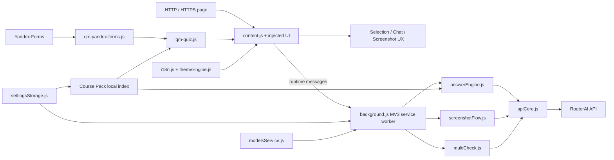

<p align="right">
  <b>Русский</b> · <a href="README.en.md">English</a>
</p>

<p align="center">
  
</p>

# QuizMind Yandex

<p align="center">
  <b>Chrome Extension на Manifest V3 для AI-помощи по тексту, скриншотам и Яндекс Формам</b><br />
  Semantic DOM extraction · RouterAI · Мультимодальный анализ скриншотов · Multi-model consensus · Course Pack grounding
</p>

<p align="center">
  
  
  
  
  
  
</p>

<p align="center">
  <a href="TECHNICAL.md"><b>Техническая документация</b></a> ·
  <a href="COURSE_PACK_GUIDE.md">Course Pack guide</a> ·
  <a href="docs/routerai-smoke-test.md">RouterAI smoke test</a>
</p>

## Обзор

QuizMind Yandex — Chrome-расширение с двумя связанными сценариями работы. На обычных HTTP/HTTPS-страницах оно умеет сохранять выделенный текст или скриншот и запрашивать ответ через RouterAI. На `forms.yandex.ru` дополнительно включается semantic adapter, который понимает поддерживаемые элементы формы, извлекает структурированное представление активного вопроса, умеет заранее готовить ответы для видимых вопросов и применяет ответ только при отдельно включённой настройке **Quiz Auto Apply**.

Yandex Forms workflow намеренно основан на видимой семантике страницы, а не на внутренних идентификаторах React. Для построения запроса используются текст вопроса, нативные типы controls, accessibility-атрибуты combobox, видимый текст вариантов и их текущий порядок в DOM. Сгенерированные ID и raw input values не используются как буквы ответа.

В проект также входят настраиваемый выбор моделей RouterAI, профили vision-запросов, Multi-Check consensus, встроенные окна Chat/History, RU/EN локализация интерфейса, темы, диагностическое логирование, Test Mode и **Course Pack** grounding, который локально находит релевантные chunks лекций до отправки AI-запроса.

Предыдущий подробный README полностью сохранён без потери информации в **[TECHNICAL.md](TECHNICAL.md)**. Текущий README служит как portfolio/product overview, а технический файл остаётся исходной компактной справкой по поведению расширения, установке, правилам Yandex Forms, verification forms, лимитам и release-safety ограничениям.

## Что демонстрирует проект

- **Архитектуру Chrome Extension / Manifest V3** с MV3 service worker, content scripts, popup, options page, command hotkeys, `chrome.storage`, `chrome.scripting`, `captureVisibleTab`, downloads и web-accessible UI assets.
- **Semantic DOM adapter для Яндекс Форм**, использующий стабильные классы, нативные input types, accessibility roles/attributes, проверки видимости и реальный порядок отображаемых вариантов вместо сгенерированных framework identifiers.
- **Контролируемое взаимодействие с формой** для radio, checkbox, text, numeric, textarea, native select и accessible custom combobox с confidence thresholds при matching и обязательной проверкой состояния после применения.
- **Мультимодальный screenshot pipeline** с ручным ROI или захватом viewport, преобразованием CSS-координат в capture pixels, crop/resize через `OffscreenCanvas`, JPEG compression profiles, model-aware timeouts, retry/fallback compression и vision-запросами через RouterAI.
- **Multi-model verification** с параллельными структурированными ответами, определением disagreement, опциональным debate round, отдельной judge model, parsing confidence/verdict и majority fallback.
- **Локальное grounding по материалам курса** через формат `quizmind.coursepack.v1`: validation/sanitization, локальный индекс, weighted retrieval chunks, жёсткие size/count limits и добавление только релевантных фрагментов в Chat и Yandex Forms requests.
- **Defensive AI request handling** с валидацией API key, timeout, cancellation, ограниченными retry для `429`/`5xx`/network failures, отдельной обработкой reasoning-моделей, нормализацией output и recovery-запросом при обрезанном screenshot-ответе с `finish_reason=length`.
- **Browser-side testing и safety checks** с jsdom fixtures, browser smoke tests, проверкой manifest/local files, syntax check JavaScript, поиском secret-like patterns, тестами escaping hostile model HTML и явной проверкой того, что auto-apply никогда не отправляет форму.

## Основные сценарии

### Выделенный текст на обычной странице

```text
выделение текста
    ↓
selection snapshot + ближайший контекст
    ↓
Find action
    ↓
content script → MV3 service worker
    ↓
RouterAI Chat Completions
    ↓
on-page окно ответа
```

Selection snapshot создаётся до начала асинхронной работы и сохраняет cloned DOM Range, ближайший поддерживаемый вопрос и локальный контекст. На сайтах вне Yandex Forms расширение показывает результат, но не сканирует и не заполняет элементы страницы автоматически.

### Вопрос Яндекс Формы

```text
selection / focused control / hovered question
    ↓
semantic Yandex Forms adapter
    ↓
тип вопроса + видимый текст + видимые варианты
    ↓
text request ИЛИ screenshot всего блока вопроса
    ↓
RouterAI text / vision model
    ↓
подготовленный ответ
    ↓
опциональный controlled apply + verification
```

Выбор целевого вопроса детерминирован: текущий selection → focused control → последний hovered question → fallback только если на экране ровно один answerable question.

### Screenshot workflow

```text
Ctrl/Cmd + Shift + U
    ↓
ручная область или видимый viewport
    ↓
chrome.tabs.captureVisibleTab
    ↓
ROI mapping + crop + resize + JPEG optimization
    ↓
vision-capable модель RouterAI
    ↓
окно ответа
    ↓
опциональный Screenshot Multi-Check
```

Новый screenshot task отменяет предыдущий активный запрос. Для разных классов vision-моделей используются разные timeout/compression profiles, а повторяемая ошибка primary request может привести к дополнительному сжатию изображения и fallback-запросу.

## Поддержка Яндекс Форм

| Control / контент | Поведение |
| --- | --- |
| Single choice | Извлекает видимые radio options; принимает label варианта или совпадающий текст. |
| Multiple choice | Разбирает несколько answer tokens и обновляет требуемый набор checkbox. |
| Short text | Записывает значение через native value path, отправляет input/change-related events и проверяет итоговое видимое значение. |
| Numeric | Извлекает числовой candidate и записывает нормализованное значение. |
| Long text | Поддерживает `textarea` через тот же write-and-verify workflow. |
| Native select | Сопоставляет ответ с видимым option text и выбирает соответствующее value. |
| Accessible custom combobox | Открывает controlled listbox, ждёт появления видимых options, сопоставляет текст, кликает и проверяет selected/visible state. |
| Question/option images | Помечает вопрос как visual и может захватить весь видимый блок вопроса для vision model. |

Intro blocks, detached/hidden controls, date/time controls и пустые matrix shells намеренно игнорируются. Автоматическое применение ответа включается отдельно от page scan, а код никогда не нажимает **Next**, **Submit** или другие navigation controls.

## Quiz Page Scan и controlled apply

Scan engine хранит собственный cache, карту in-flight запросов, набор уже запрошенных signatures и состояние применённого signature для каждого question container. Он следит за dynamic DOM changes и может обнаруживать вопросы, добавленные после первоначальной загрузки страницы.

В коде зафиксированы явные operational limits:

- prefetch batch size: **3**;
- maximum concurrent prefetch requests: **3**;
- per-page request budget: **60 unique question signatures**;
- answer-cache cap: **200 entries**;
- failed-request retry delay: **20 seconds**;
- DOM mutation ignore window после apply: **3 seconds**.

Answer matching сначала проверяет точный label/text match, а затем использует fuzzy similarity с защитой от неоднозначности. Для text fields расширение проверяет фактическое `.value`; для choice controls оно уважает состояние, полученное после обычного browser click, и не обходит ограничения самой формы.

## Интеграция RouterAI

Service worker отправляет запросы в OpenAI-compatible endpoint:

```text
https://routerai.ru/api/v1/chat/completions
```

Text и image models загружаются через RouterAI `/models`. Каталоги chat/image фильтруются по объявленным modalities и кэшируются локально на **24 часа**. Favorite models сохраняются в extension settings.

Общий API layer реализует:

- `Authorization: Bearer <key>`;
- базовый timeout **25 секунд** с workflow-specific overrides;
- один retry после исходного запроса для timeout/network, `429` и `5xx` ошибок;
- propagation `AbortController` и замену активной задачи новой;
- выбор `max_tokens` / `max_completion_tokens` в зависимости от request/model type;
- low-effort reasoning configuration для распознанных reasoning-моделей в соответствующих flows;
- безопасное извлечение assistant content без разрушительного сокращения free-text ответа до одной буквы;
- recovery request для screenshot response, завершившегося с `finish_reason=length`.

## Screenshot и multimodal processing

Screenshot requests по умолчанию не отправляются как необработанный browser capture. Pipeline умеет переводить ROI из CSS-space в capture pixels, вырезать область через `OffscreenCanvas`, уменьшать изображение по большей стороне и преобразовывать его в JPEG перед API call.

Request profile зависит от класса выбранной модели. Lightweight, default и heavy vision models получают разные timeout и image-size profiles; пользовательская screenshot temperature ограничивается диапазоном `0…1`, а screenshot output — `32…2048` tokens.

Для visual questions в Яндекс Формах расширение захватывает целиком bounds вопроса и отправляет screenshot вместе со структурированными данными о типе, prompt и options, чтобы image options оставались связаны с текущим видимым порядком `A`, `B`, `C`, ….

## Multi-Check consensus

Multi-Check — отдельный verification layer, а не просто повтор одного запроса. Image pipeline поддерживает:

1. параллельный structured analysis (`OBSERVED`, `OPTIONS`, `DIAGRAM`, `ANSWER`, `CONFIDENCE`, `REASON`);
2. определение disagreement;
3. опциональный debate/revision round, где каждая модель видит ответы других;
4. vision-capable judge, которому передаются изображение, реальный вопрос и structured evidence;
5. fallback на text judge или majority result при необходимости.

Text Multi-Check использует ту же общую идею независимых ответов и итогового consensus/verdict. Минимальные token floors для structured output не дают слишком маленькому screenshot token setting обрезать служебный формат проверки.

## Course Pack grounding

Course Pack — локальный предварительно подготовленный knowledge layer для ответов в логике конкретного курса. Расширение валидирует `quizmind.coursepack.v1`, сохраняет только поддерживаемые поля, строит локальный search index и выбирает релевантные chunks перед запросом вместо отправки всего архива курса.

Текущие hard limits:

| Ограничение | Значение |
| --- | ---: |
| Course Pack JSON | 8 MB |
| Lectures | 500 |
| Chunks | 2 000 |
| Chunks на один request | 8 |
| Course context на request | 8 000 characters |

Ranking учитывает совпадения query tokens с keywords, headings, названиями лекций, текстом и visual descriptions, дополнительно повышая вес сильных phrase/keyword matches. Добавляемый контекст явно инструктирует модель при конфликте отдавать приоритет переданным excerpts курса над general knowledge.

Полная схема, workflow подготовки, правила OCR/visual-page анализа, chunking и privacy/copyright ограничения описаны в **[COURSE_PACK_GUIDE.md](COURSE_PACK_GUIDE.md)**.

## On-page UI, Chat и Settings

Injected UI содержит окна Answer, History, Chat, Multi-Check, Logs и Settings с сохранением layout state. Поддерживаются независимые position/size окон, выбор screen side/active zone, timers, hotkeys, model selectors, Test/Developer modes и themes.

Интерфейс имеет встроенную **английскую и русскую локализацию**. Model lists, settings labels, Course Pack controls, hotkey descriptions и status messages переводятся через локальный registry `i18n.js`.

Chat workflow sanitizes историю и attachments до передачи в service worker. Текущие ограничения включают до **20** последних сообщений в запросе, до **4** изображений в одном user message и до **3** file attachments с лимитом **8 MB** на один файл и **12 MB** суммарно. Поддерживаются PDF, Office formats, plain text/Markdown, CSV, JSON и XML. Для PDF request можно явно использовать RouterAI plugin `file-parser` с engine `mistral-ocr`.

## Privacy и safety boundaries

- API keys и settings хранятся локально в Chrome extension storage и не находятся в репозитории.
- Выделенный текст, извлечённый question content, screenshots и явные Chat attachments отправляются только при соответствующем AI request.
- Diagnostic content logging **выключен по умолчанию** и не накапливает diagnostics, пока logging отключён.
- При включённом debug logging могут сохраняться укороченные question/answer diagnostics, но API keys исключены.
- Обычные HTTP/HTTPS страницы поддерживают Find и Screenshot, но Yandex-specific scan/auto-apply/visual-question automation остаётся ограничена `forms.yandex.ru`.
- Manifest объявляет `<all_urls>`, потому что `captureVisibleTab` требует host/active-tab grant для screenshot capture; сами content scripts запускаются только на обычных `http://*/*` и `https://*/*`, а не на browser-internal schemes.
- Auto-apply намеренно не отправляет форму: automated tests отдельно проверяют отсутствие submit/navigation actions.

## Архитектура



Главная architecture/security boundary проходит между **page content scripts** и **MV3 service worker**. Код на стороне страницы извлекает semantic context и рисует UI; service worker отвечает за RouterAI network calls, model discovery, screenshot orchestration, Multi-Check и privileged Chrome APIs.

## Структура репозитория

```text
.
├── manifest.json                  # MV3 permissions, commands, scripts, popup/options
├── background.js                  # Service worker, routing, injection, privileged APIs
├── apiCore.js                     # RouterAI request/retry/timeout/content handling
├── answerEngine.js                # Text answers and sanitized chat requests
├── screenshotFlow.js              # Screenshot capture, ROI mapping, compression, fallback
├── multiCheck.js                  # Multi-model consensus, debate, judge, verdicts
├── modelsService.js               # RouterAI model catalog, modality filters, 24h cache
├── settingsStorage.js             # Settings + Course Pack validation/index/retrieval
├── promptsConfig.js               # Configurable prompt registry
├── i18n.js                        # English/Russian UI localization
├── themeEngine.js                 # Theme/chameleon behavior
├── logger.js                      # Service-worker diagnostics
├── content.js                     # Main in-page UI, selection, chat, history, capture UX
├── content/
│   ├── qm-yandex-forms.js         # Semantic Yandex Forms adapter
│   ├── qm-quiz.js                 # Scan/cache/matching/controlled apply engine
│   ├── qm-hotkeys.js              # Hotkey parsing/matching
│   ├── qm-markdown.js             # Escaped Markdown/LaTeX rendering
│   ├── qm-windows.js              # Window/layout helpers
│   ├── qm-logger.js               # Content-side diagnostics
│   └── qm-shared.js               # Shared content-script utilities
├── popup.html / popup.js          # Quick controls
├── options.html / options.js      # Full settings interface
├── COURSE_PACK_GUIDE.md           # Course Pack format and authoring workflow
├── examples/course-pack.example.json
├── scripts/                       # Validation and browser/RouterAI smoke tests
├── tests/                         # Node/jsdom regression tests and fixtures
└── ui/                            # Answer/chat/history/window CSS
```

## Быстрый старт

### Требования

- Google Chrome или совместимая development environment для загрузки Chrome MV3 extension;
- Node.js **16+** и npm для development checks;
- RouterAI API key для live model requests.

### 1. Установка development dependencies

```bash
npm install
```

### 2. Проверки

```bash
npm test
npm run check
npm run test:browser:generic
```

### 3. Загрузка расширения

1. Откройте `chrome://extensions`.
2. Включите **Developer mode**.
3. Выберите **Load unpacked**.
4. Укажите директорию этого репозитория.
5. Откройте popup QuizMind Yandex → Settings.
6. Добавьте RouterAI API key и выберите text/vision models.

Для release verification без расхода live model tokens можно включить **Test Mode**. Он возвращает mocked answers и предназначен для локальной проверки.

## Горячие клавиши

Основные default commands из manifest:

| Действие | Windows / Linux | macOS |
| --- | --- | --- |
| Screenshot answer | `Ctrl+Shift+U` | `Command+Shift+U` |
| Включить / выключить extension | `Ctrl+Shift+L` | `Command+Shift+L` |
| Yandex Forms question | `Ctrl+Shift+H` | `Command+Shift+H` |

Дополнительные in-page hotkeys и их редактируемые настройки доступны в интерфейсе расширения и технической документации.

## Тестирование и verification

`npm test` запускает встроенный Node test runner для Yandex adapter suite на jsdom fixtures. Тесты покрывают semantic host detection, supported/ignored controls, dynamic question discovery, image detection, structured prompts, exact/fuzzy matching, применение radio/checkbox/text/numeric/select/combobox, selection snapshots, page scan, escaping hostile model HTML, поведение отключённого logging, hotkey matching и invariant «никогда не отправлять форму».

`npm run check` проверяет Manifest V3 metadata, обязательные host permissions, все local files, на которые ссылается manifest, syntax каждого JavaScript-файла в репозитории и несколько patterns, похожих на API/private keys.

Browser smoke scripts покрывают Yandex-specific flow и generic HTTP/HTTPS Find/Screenshot behavior. В `docs/routerai-smoke-test.md` описана отдельная опциональная проверка с live RouterAI.

## Известные ограничения

К намеренно неподдерживаемым или ограниченным сценариям относятся browser-internal pages, Chrome Web Store, date/time widgets Яндекс Форм, пустые matrix shells, image questions за пределами текущего viewport без явного переноса в capture, per-page scan budget и live requests без валидного RouterAI key.

Исходный компактный список ограничений и public verification instructions сохранён в **[TECHNICAL.md](TECHNICAL.md)**.

## Документация

- **[TECHNICAL.md](TECHNICAL.md)** — предыдущий README, сохранённый без потери технических деталей.
- **[COURSE_PACK_GUIDE.md](COURSE_PACK_GUIDE.md)** — schema Course Pack, workflow подготовки контента, OCR/visual interpretation, chunking, validation и safe-use notes.
- **[docs/routerai-smoke-test.md](docs/routerai-smoke-test.md)** — процедура live RouterAI smoke test.
- **[examples/course-pack.example.json](examples/course-pack.example.json)** — минимальный пример Course Pack.

## Статус

Репозиторий содержит **QuizMind Yandex 1.0.0** — JavaScript Manifest V3 extension с отдельным semantic workflow для Яндекс Форм и универсальными Selected Text / Screenshot сценариями для обычных HTTP/HTTPS страниц. В репозитории находятся extension code, локальные tests, browser smoke tests и validation scripts; live AI behavior требует собственных RouterAI credentials пользователя.
